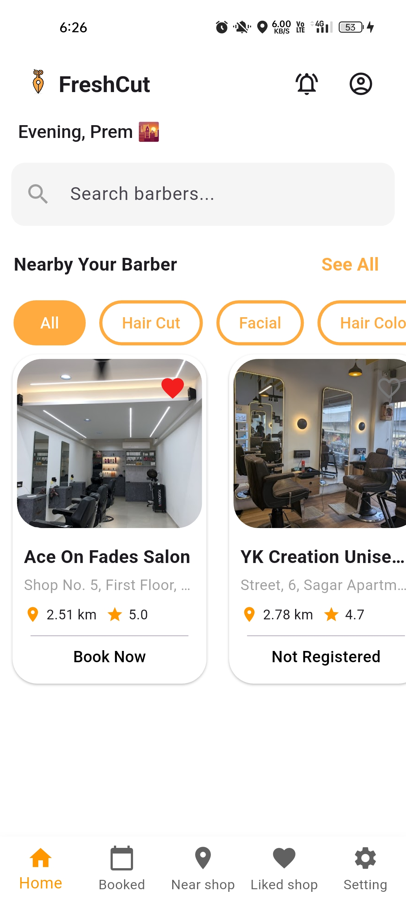
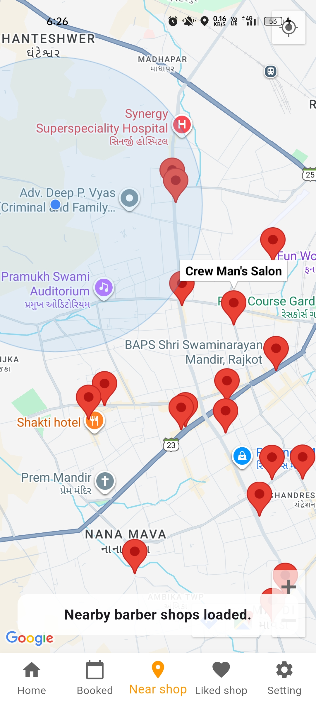
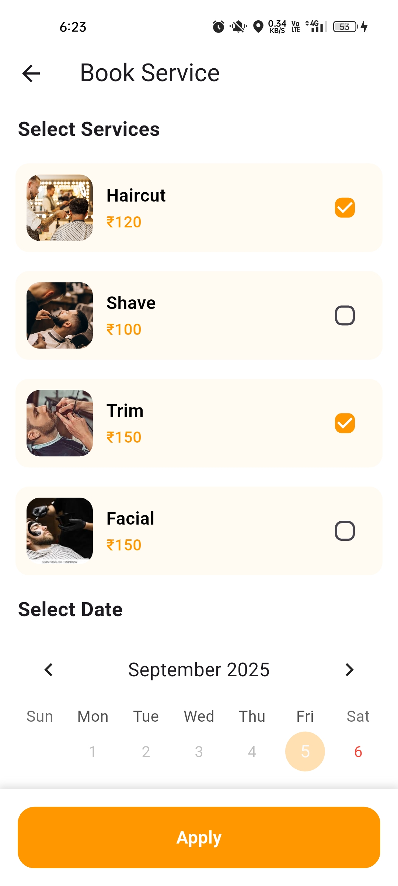
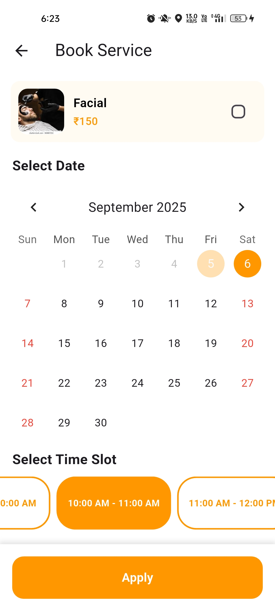
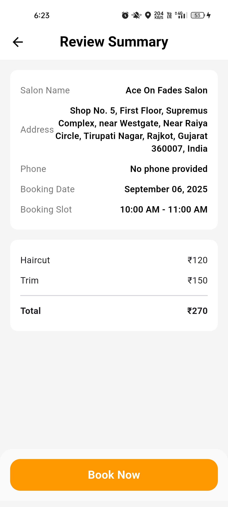
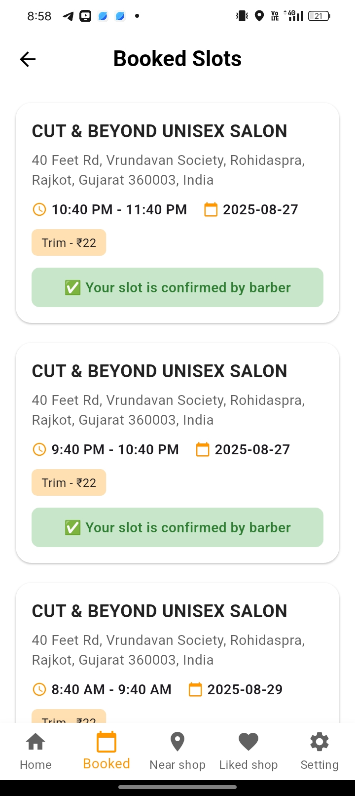
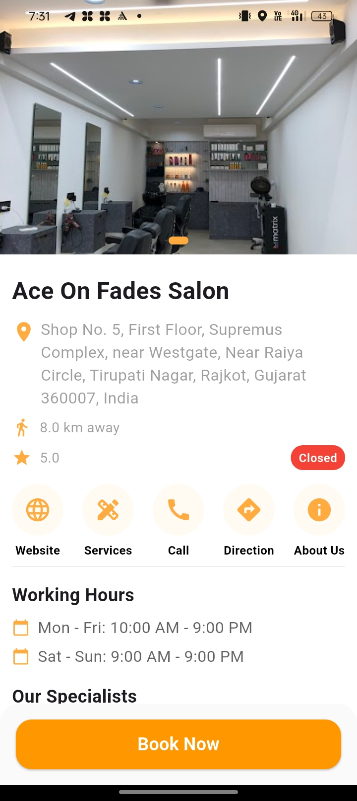
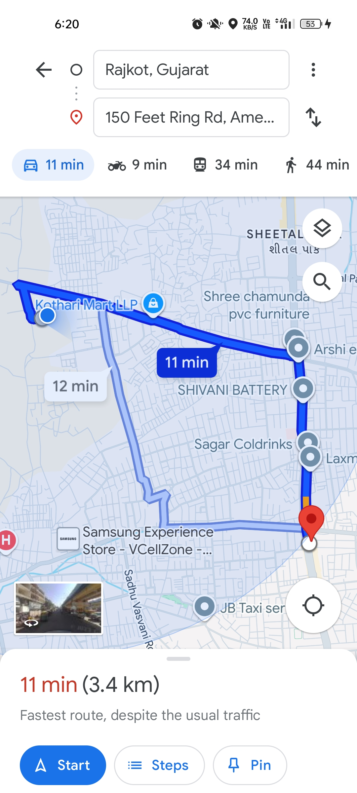
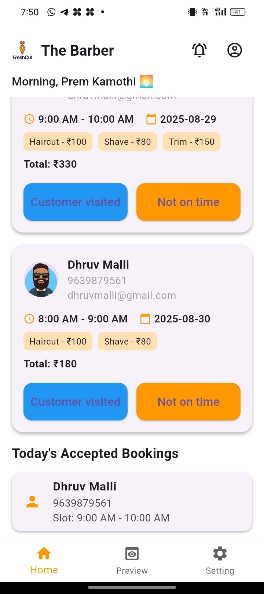

<p align="center">
  
</p>

<h1 align="center">FreshCut – Barber Booking App</h1>

## 📖 About
<p align="justify">
The Barber Booking App is a mobile-based application developed using Flutter and Firebase, designed to simplify the process of booking salon and barber 
services. The system provides a digital platform where customers can discover nearby barbershops, view shop profiles, select services, and book appointment 
slots seamlessly. It eliminates the inconvenience of traditional walk-in appointments and manual scheduling by providing real-time slot availability 
and navigation support.
</p>

---

## ✨ Features
- 🔐 *Role-based signup/login* – separate flows for customers and barbers
- 🗺 *Nearby barbershop discovery* using Google Places API
- 🏠 *Customer dashboard* with shop list, favorites, and booking options
- 💈 *Barber dashboard* to manage profile, services, and available time slots
- 📝 *Digital shop profiles* with working hours, services, and about section
- 📅 *Booking slot management* to prevent overbooking
- 📍 *In-app navigation* using Google Maps SDK
- ☁ *Realtime updates* with Firestore sync between barber and customer
- 📊 *Scalable cloud infrastructure* for future expansion
- 🔐 *Secure data access* with Firebase Authentication

---

## 🛠 Tech Stack
- Flutter & Dart
- Firebase (Auth, Firestore, Storage)
- Android Studio
- Google Places API
- Google Maps SDK
- GitHub (Version Control)

---

## 📱 App Screenshots

<p align="center">
   &nbsp;&nbsp;
   &nbsp;&nbsp;
   
</p>

<p align="center">
   &nbsp;&nbsp;
   &nbsp;&nbsp;
  
</p>

<p align="center">
   &nbsp;&nbsp;
   &nbsp;&nbsp;
  
</p>

---

## 🚀 Installation & Setup

### 1. Prerequisites
- An IDE like **Android Studio** or **VS Code**
- [Flutter SDK](https://docs.flutter.dev/get-started/install) (latest stable)
- [Dart](https://dart.dev/get-dart) (comes with Flutter)
- [Firebase CLI](https://firebase.google.com/docs/cli)


### 2. Clone the Project
```bash
git clone https://github.com/premkamothi/FreshCut-Barber-Booking-App.git
cd FreshCut-Barber-Booking-App
```
### 3. Get your API key

1. Go to [Google Cloud Console](https://console.cloud.google.com/).
2. Log in with your Google account.
3. Create a new project (or select an existing one).
    - Click on **Project Selector** (top-left dropdown).
    - Click **New Project**, give it a name (e.g., `FreshCut-Barber-Booking-App`), and click **Create**.
4. Enable required APIs:
    - In the left sidebar, go to **APIs & Services > Library**.
    - Search for and enable the following:
        - **Places API**
        - **Maps SDK for Android**
5. Create API credentials:
    - Go to **APIs & Services > Credentials**.
    - Click **+ CREATE CREDENTIALS** → **API Key**.
    - Copy the generated API key.
6. Secure the API key (highly recommended):
    - Under your new key, click **Restrict Key**.
    - In **Application restrictions**, choose:
        - **Android apps** (add your SHA-1 + package name)
        - or **HTTP referrers** (if using web).
    - In **API restrictions**, select:
        - **Places API**
        - **Maps SDK for Android**
    - Save your changes.
7. Add the API key to your Flutter app:
    - Go to **api_key.dart** and copy you key there.

### 4. Run in your Phone
- Go to phone setting and start Developer mode.
- Connect phone with laptop (Allow USB debugging).
  ```bash
  flutter pub get
  flutter run
  ```
---
## 📚 References
1. [Google Firebase Documentation](https://firebase.google.com/docs)
2. [Google Maps Platform Documentation](https://developers.google.com/maps)
3. [Flutter Official Documentation](https://docs.flutter.dev)
4. [Pub Dev](https://pub.dev/)
5. [ImageKit](https://imagekit.io/)
6. [Figma UI Kit – Casca Barber & Salon](https://www.figma.com/design/EEhKdohmQQZ04oihq5ADLO/Casca--Barber---Salon-App-UI-Kit--Preview-?node-id=1227-180&t=2oFxIEyOhJGtIrbX-0)

---

## 👨‍💻 Developed By
- *Prem Kamothi*
- *Dhruv Malli*  
