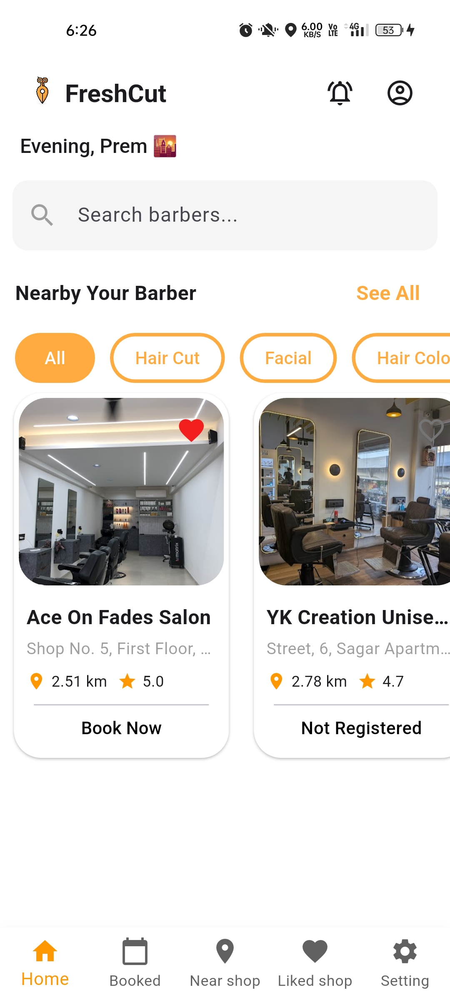
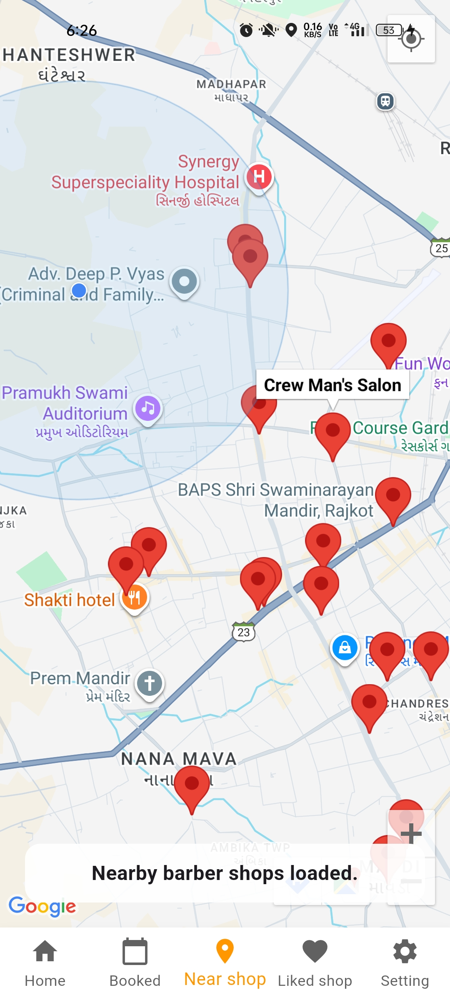
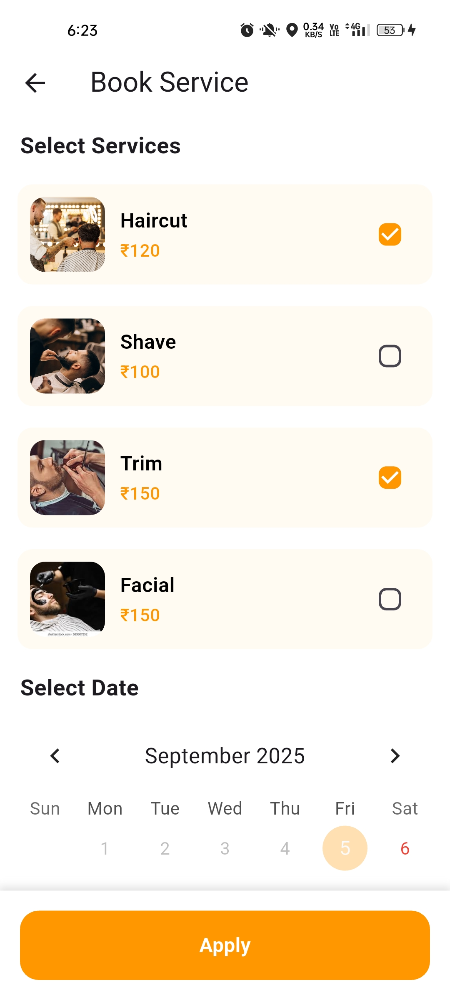
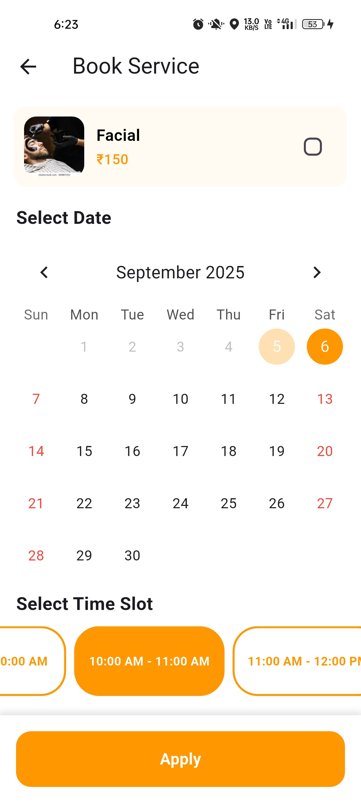
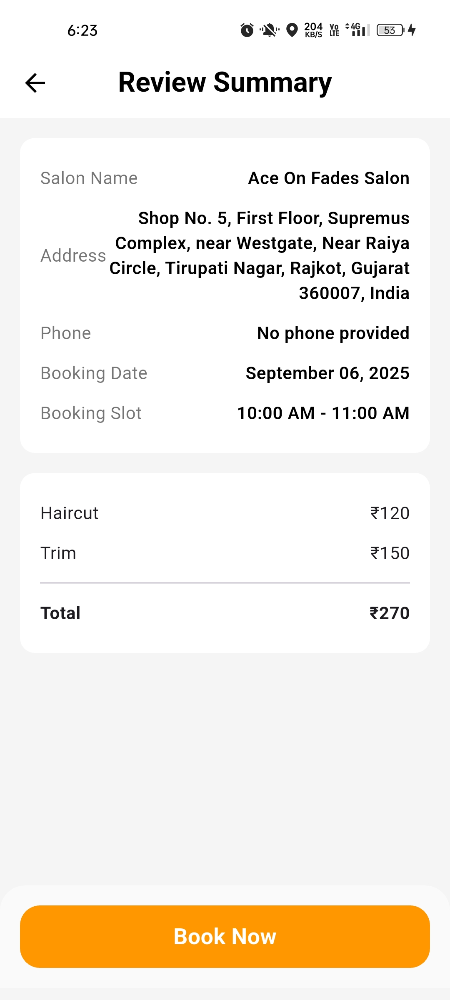
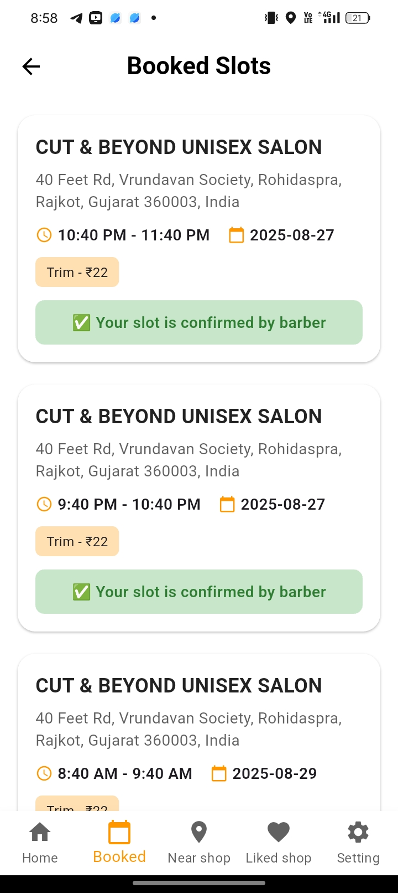
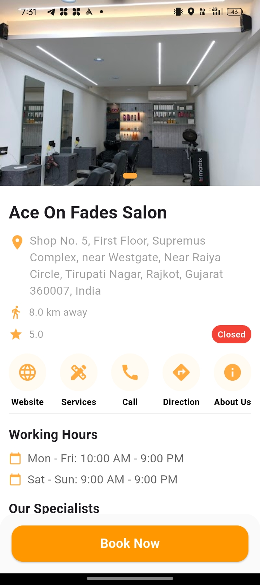
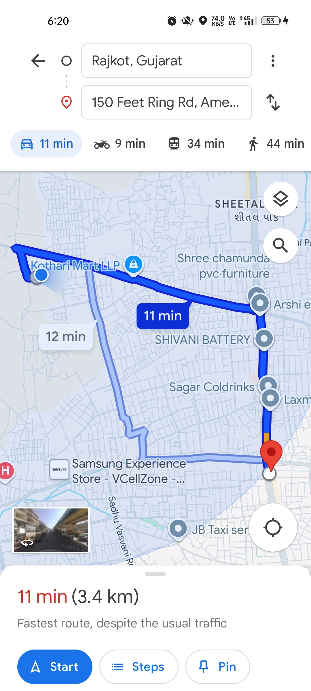
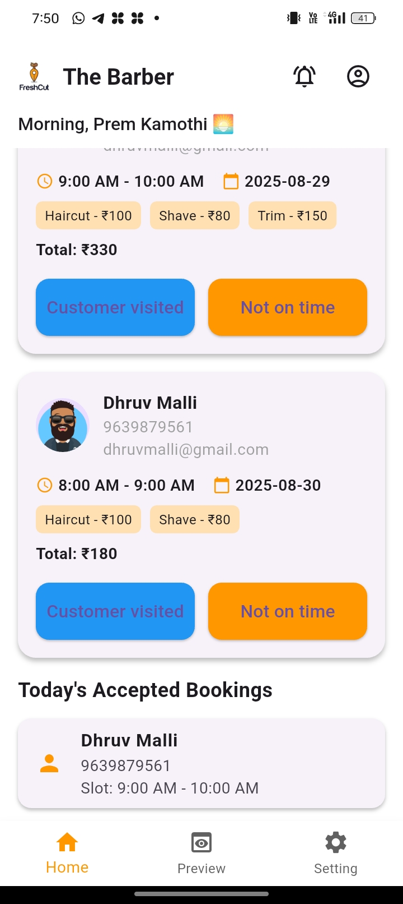

  

<h1 align="center">FreshCut – Barber Booking App</h1>

## 📖 About

The FreshCut is a mobile-based application developed using Flutter and Firebase, designed to simplify the process of booking salon and barber 
services. The system provides a digital platform where customers can discover nearby barbershops, view shop profiles, select services, and book appointment 
slots seamlessly. It eliminates the inconvenience of traditional walk-in appointments and manual scheduling by providing real-time slot availability 
and navigation support.

---

## ✨ Features
- 🔐 **Role-based signup/login** – separate flows for customers and barbers  
- 🗺 **Nearby barbershop discovery** using Google Places API  
- 🏠 **Customer dashboard** with shop list, favorites, and booking options  
- 💈 **Barber dashboard** to manage profile, services, and available time slots  
- 📝 **Digital shop profiles** with working hours, services, and about section  
- 📅 **Booking slot management** to prevent overbooking  
- 📍 **In-app navigation** using Google Maps SDK  
- ☁️ **Realtime updates** with Firestore sync between barber and customer  
- 📊 **Scalable cloud infrastructure** for future expansion  
- 🔐 **Secure data access** with Firebase Authentication  

---

## 🛠 Tech Stack
- Flutter & Dart  
- Firebase (Auth, Firestore, Storage)  
- Android Studio  
- Google Places API  
- Google Maps SDK  
- GitHub (Version Control)    

---

## 📱 App Screenshots

   &nbsp;&nbsp;
   &nbsp;&nbsp;
   

   &nbsp;&nbsp;
   &nbsp;&nbsp;
  

   &nbsp;&nbsp;
   &nbsp;&nbsp;
  

---

## 📚 References
1. [Google Firebase Documentation](https://firebase.google.com/docs)  
2. [Google Maps Platform Documentation](https://developers.google.com/maps)  
3. [Flutter Official Documentation](https://docs.flutter.dev)  
4. [Pub Dev](https://pub.dev/)  
5. [ImageKit](https://imagekit.io/)  
6. [Figma UI Kit – Casca Barber & Salon](https://www.figma.com/design/EEhKdohmQQZ04oihq5ADLO/Casca--Barber---Salon-App-UI-Kit--Preview-?node-id=1227-180&t=2oFxIEyOhJGtIrbX-0)
   
---

## 👨‍💻 Developed By
- **Prem Kamothi**  
- **Dhruv Malli** 

